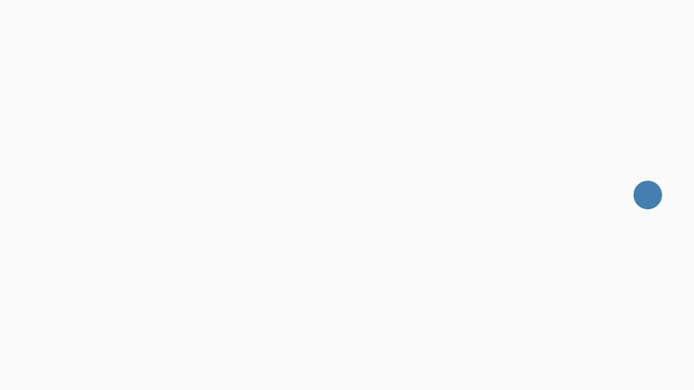
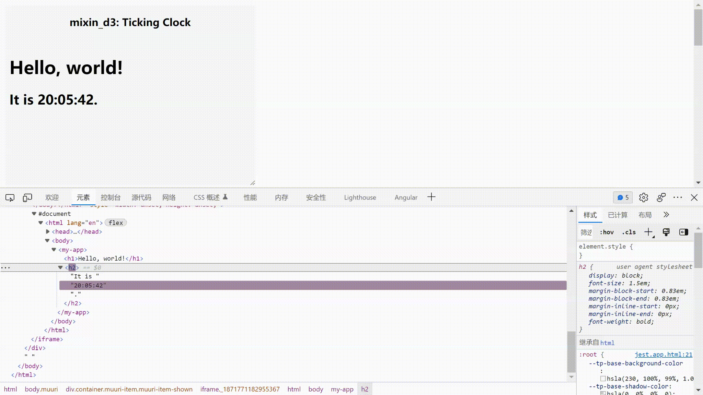

[](https://www.npmjs.com/package/mixin_d3)
[](https://vegertar.github.io/mixin_d3/)

# Mixin D3

Although the component-based frameworks, e.g. vue, react, angular, are used everywhere, [D3js](https://d3js.org/) is still the industry standard for data visualization. Lots seem not to be big fans of how D3 handles updating DOM, especially at the moment that [You-Don't-Need-jQuery](https://github.com/nefe/You-Dont-Need-jQuery). Then some things become interesting and annoying, libraries go back and forth between abstraction and flexibility, from the most talented DSL to low-level vanilla js, many awesome projects appear every year, as well as the totally awesome browsers.

Modern browsers come with a suite of different technologies called [Web Components](https://developer.mozilla.org/en-US/docs/Web/Web_Components), the heavily used development way in our vanilla js projects, with loads of dependent of D3, I write the [mixin_d3.js](/lib/mixin_d3.js), to approach a little bit of more friendly data-driven programming, which just works as below.<sup class="footnote-ref"><a href="#fn1" id="fnref1">[1]</a></sup> [_Edit in here_](https://stackblitz.com/edit/js-c6aqfb?file=index.js), or if you [_prefer typescript_](https://codesandbox.io/s/long-violet-7d9ehm?file=/src/index.ts).

<div class="repeat-circle">
  

```js
document.body.innerHTML = '<my-app viewBox="0,0,960,500"></my-app>';
const myApp = document.querySelector("my-app");
myApp.data = [
  {
    tag: "circle",
    attrs: {
      class: "component",
      fill: "steelblue",
      r: 20,
      cx: 40,
      cy: 250,
    },
    transitions: [
      {
        duration: 2000,
        attrs: { cx: 920 },
      },
      {
        duration: 2000,
        attrs: { cx: 40 },
        events: {
          end() {
            // repeat the circle
            myApp.data[0].transitions = myApp.data[0].transitions;
          },
        },
      },
    ],
  },
];
```

</div>

It seems yet another JSON-style coding library? 😒, um...Yes, a sort of. If you're interested, don't be hesitated to run/test the code, just `yarn && yarn tw` and open [http://localhost:3000](http://localhost:3000) to see more examples, such as a very simple [bar chart](/__tests__/lib/bar_chart.js), [Tic Tac Toe](/__tests__/lib/tic_tac_toe.js) against [react tutorial](https://reactjs.org/tutorial/tutorial.html#completing-the-game). All codes are MIT licenced, please feel free to copy or prune to anywhere you like.

<details>
  <summary>
    Happy coding.
  </summary>

<br/>

> NOTE: _Following contents are modified from [reactjs](https://github.com/reactjs/reactjs.org) along with [CC-BY-4.0 license](https://github.com/reactjs/reactjs.org/blob/main/LICENSE-DOCS.md)._

## Hello World

The smallest mixin_d3 example looks like this:

```js
<script type="module">
  window.customElements.define(
    "my-app",
    class extends MixinD3 {
      connectedCallback() {
        super.connectedCallback();
        this.data = [{ tag: "h1", text: "Hello, World" }];
      }
    }
  );
</script>

<my-app></my-app>
```

It displays a heading saying "Hello, world!" on the page.

**[Try it on CodePen](https://codepen.io/vegertar/pen/MWQRybP)**

Click the link above to open an online editor. Feel free to make some changes, and see how they affect the output. Most pages in this guide will have editable examples like this one.

## Rendering Children

Children are the smallest building blocks of mixin_d3 Web Components.

A child describes what you want to see on the screen:

```js
const children = [{ tag: "h1", text: "Hello, world" }];
```

Unlike browser DOM elements, mixin_d3 children are JSON-like objects, and are cheap to create. mixin_d3 takes care of updating the DOM to match the children.

### Rendering children into the DOM

Let's say there is a `<my-app>` somewhere you have created from [Hello World](#hello-world) section in your HTML file:

```html
<my-app>
  <h1>Hello, World</h1>
</my-app>
```

By default, a custom element itself or its attached `shadowRoot` is the "root" DOM node where mixin_d3 will render children at. In the case of `<my-app>` the `root` is itself.

To render mixin_d3 children, simply assigns the array to `myApp.data`:

```js
document.querySelector("my-app").data = [{ tag: "h1", text: "Hello, world" }];
```

**Toggle on the Console panel in [Hello World](https://codepen.io/vegertar/pen/MWQRybP) example and paste the above code.**

It displays "Hello, world" on the page.

### Updating the Rendered Element

mixin_d3 children are [changelog](https://en.wikipedia.org/wiki/Changelog). Once you create a child datum, you can change its attributes, properties, etc.. A child is merely a set of modifications, unlike react's element which depicts a full state of UI.

With our knowledge so far, one way to update the UI is just mutate `this.data`.

Consider this ticking clock example:

```js
class MyApp extends MixinD3 {
  connectedCallback() {
    super.connectedCallback();
    this.data = [
      { tag: "h1", text: "Hello, world!" },
      { tag: "h2", key: (d) => d },
    ];

    setInterval(() => {
      this.data[1].children = ["It is ", new Date().toLocaleTimeString(), "."];
    }, 1000);
  }
}
```

**[Try it on CodePen](https://codepen.io/vegertar/pen/KKQYRyW)**

It sets `this.data[1].text` every second from a [`setInterval()`](https://developer.mozilla.org/en-US/docs/Web/API/WindowTimers/setInterval) callback.

## Only Updates What’s Necessary?

Short answer is can. Unlike react acts as a black box for DOM comparison, mixin_d3 derives d3 which maps data to node explicitly by either `index` or `key` to determine if to create/update/destroy a node. In last example we use the `key` function `(d) => d` to let d3 identify &lt;h2&gt;'s children by data itself, i.e. `"It is " `, `` `${new Date().toLocaleTimeString()}` `` and `"."`.

You can verify by inspecting the [last example](https://codepen.io/vegertar/pen/KKQYRyW) with the browser tools:



Even though we reset the children array describing the whole UI tree on every tick, only the text node whose contents have changed gets updated by the way [how d3 works with a `key`](https://bost.ocks.org/mike/selection/#key). If you remove it, you will see nothing changed after the first rendering for such children.

</details>

<hr class="footnotes-sep">
<section class="footnotes">
  <ol class="footnotes-list">
    <li id="fn1" class="footnote-item">
      <p>The corresponding D3 example is
        <a href="https://bl.ocks.org/d3noob/bf44061b1d443f455b3f857f82721372">here</a>
        <a href="#fnref1" class="footnote-backref">↩</a>
      </p>
    </li>
  </ol>
</section>
